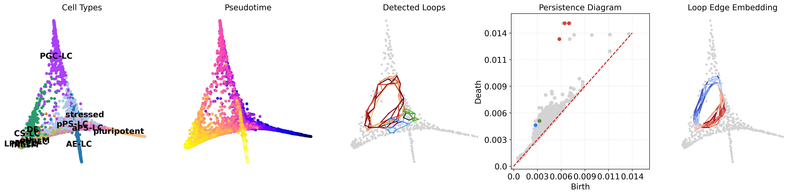

# scloop - single-cell loop analysis

[](https://github.com/stanfish06/scLoop/actions/workflows/test-import.yml)
[](https://github.com/stanfish06/scLoop/actions/workflows/test-build.yml)

**Note: this package is still under development.**

scLoop is a library to identify statistically significant loops in single-cell RNA-seq data.



## Build Instructions
```bash
make build
make clean
```

Alternatively,
```bash
mise sync
```
